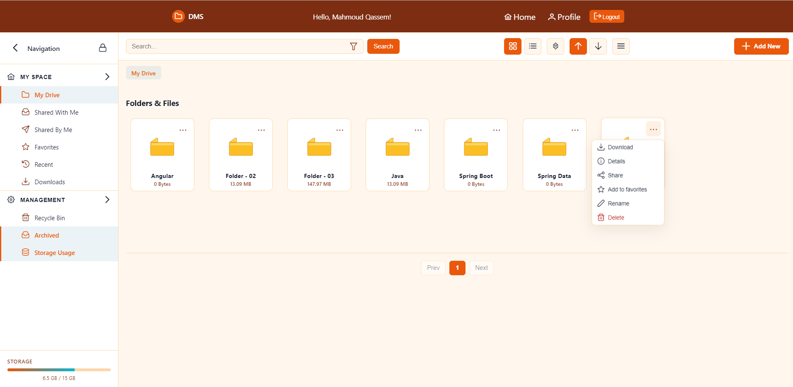

# Document Management System (DMS)

> Cloud-ready Document Management System — secure file upload, download, preview, flexible folder structure, sharing & permissions, and a responsive Angular UI.

**Live demo:** [http://dms-angular-frontend.s3-website.eu-north-1.amazonaws.com/login](http://dms-angular-frontend.s3-website.eu-north-1.amazonaws.com/login)

---

## Table of contents

1. Project Title & Short Description
2. Features
3. Tech Stack
4. Architecture (Mermaid)
5. Screenshots
6. Project structure
7. Environment variables
8. Run locally (dev)
9. API quick reference
10. Deployment (high level)
11. What I learned
12. Future improvements
13. Contributing & License

---

## 1. Project Title & Short Description

**Title:** Document Management System (DMS)

**Short description (enhanced):** DMS is a cloud storage web application that enables users to securely upload, download, preview, share and organize files into a flexible folder tree through a modern, responsive Angular UI. The backend is built with Spring Boot and Spring Security (JWT); files are stored in AWS S3, metadata and logs live in MongoDB Atlas, and relational user/auth data is stored in AWS MySQL (RDS). The frontend uses Angular, TypeScript, RxJS and PrimeNG with JWT-interceptors and Angular services for a smooth, reactive experience.


---

## 2. Features

- User registration, login, and refresh token flow (JWT).
- Role-based access control + PermissionEvaluator for fine-grained authorization.
- Upload / download files (multipart uploads supported).
- File preview (streaming where possible) and metadata retrieval.
- Rename, soft-delete (trash), hard-delete and restore for files and folders.
- Flexible folder tree with parent/child relationships and recursive operations.
- Search (files & folders) with pagination, sorting and filtering.
- Share files with other users with permissions (read-only / download).
- Activity logging and auditing (createdAt, sharedAt, owner info).
- Swagger/OpenAPI docs for exploring the API.

---

## 3. Tech Stack

**Backend**

- Java 17+, Spring Boot
- Spring Security (JWT) + PermissionEvaluator
- Spring Data JPA / Hibernate
- Lombok, ModelMapper, Global Exception Handler
- Auditing (createdAt / updatedAt)
- MySQL (AWS RDS) — relational & auth data
- MongoDB Atlas — logs / metadata / search-friendly storage
- AWS S3 — file storage

**Frontend**

- Angular, TypeScript, Angular CLI
- RxJS, Angular Services, HTTP interceptors (JWT)
- PrimeNG (UI components)
- HTML & CSS (responsive)

**Infra & Dev tools**

- Maven (backend), npm (frontend)
- Docker
- AWS Elastic Beanstalk (backend), S3 static hosting + CloudFront (frontend)
- Swagger / OpenAPI for API docs

---

## 4. Architecture 
```
dms/
 ├── src/
 │   ├── main/
 │   │   ├── java/com/mahmooud/dms/
 │   │   │   ├── controller/
 │   │   │   │    ├── AuthController.java
 │   │   │   │    ├── UserController.java
 │   │   │   │    └── DocumentController.java
 │   │   │   │
 │   │   │   ├── service/
 │   │   │   │    ├── AuthService.java
 │   │   │   │    ├── UserService.java
 │   │   │   │    └── DocumentService.java
 │   │   │   │
 │   │   │   ├── repository/
 │   │   │   │    ├── UserRepository.java
 │   │   │   │    └── DocumentRepository.java
 │   │   │   │
 │   │   │   ├── model/
 │   │   │   │    ├── User.java
 │   │   │   │    ├── Role.java
 │   │   │   │    └── Document.java
 │   │   │   │
 │   │   │   ├── security/
 │   │   │   │    ├── JwtAuthenticationFilter.java
 │   │   │   │    ├── JwtService.java
 │   │   │   │    ├── SecurityConfig.java
 │   │   │   │    └── CustomUserDetailsService.java
 │   │   │   │
 │   │   │   ├── exception/
 │   │   │   │    ├── GlobalExceptionHandler.java
 │   │   │   │    └── ResourceNotFoundException.java
 │   │   │   │
 │   │   │   ├── dto/
 │   │   │   │    ├── LoginRequest.java
 │   │   │   │    ├── RegisterRequest.java
 │   │   │   │    └── JwtResponse.java
 │   │   │   │
 │   │   │   └── DmsApplication.java
 │   │   │
 │   │   └── resources/
 │   │        ├── application.yml
 │   │        └── data.sql
 │   │
 │   └── test/
 │        └── ...
 │
 └── pom.xml


/frontend-angular
  ├─ src/
  │   ├─ app/
  │   │  ├─ services/      # HTTP services, JWT interceptors
  │   │  ├─ components/    # UI components (dashboard, folder tree, preview)
  │   │  └─ pages/
  │   └─ assets/screenshots/
  └─ angular.json
```
---
## 5. Screenshots & API Docs

The repository contains a `screenshots/` directory with UI screenshots and Swagger/OpenAPI screenshots.

```
Screenshots/AuthControllerAPIs.png
Screenshots/Dashboard.png
Screenshots/Favorites.png
Screenshots/FolderControllerAPIs.png
Screenshots/Login.png
Screenshots/Recent.png
Screenshots/RecycleBin.png
Screenshots/Register.png
Screenshots/SharedByMe.png
Screenshots/ShareWithMe.png
Screenshots/UserFilesControllerAPIs.png
Screenshots/UserFileSharingAPIs.png
```

## 6. Environment variables (example)

> _Never commit secrets to the repo._

```
# RDS
spring.datasource.url=${RDS_URL}
spring.datasource.username=${RDS_USERNAME}
spring.datasource.password=${RDS_PASSWORD}
spring.datasource.driverClassName=com.mysql.cj.jdbc.Driver

# MongoDB Atlas
spring.data.mongodb.uri=${MONGO_URI}

# ----------- AWS S3 ------------
aws.s3.bucket=${S3_BUCKET}
aws.s3.access-key=${S3_ACCESS_KEY}
aws.s3.secret-key=${S3_SECRET_KEY}
aws.s3.region=${S3_REGION}

# ----------- JWT ------------
dms.app.access.jwtSecret=${secretKey_1}
dms.app.refresh.jwtSecret=${secretKey_2}

# App
APP_FRONTEND_BASE_URL=http://dms-angular-frontend.s3-website.eu-north-1.amazonaws.com
```

---

## 7. Run locally (development)

**Backend**

1. Clone the repository
2. Populate environment variables or `application.yml`
3. Start local MySQL (or use Docker)

Build & run:

```bash
cd backend-springboot
mvn clean package
mvn spring-boot:run
```

**Frontend**

```bash
cd frontend-angular
npm install
ng serve --open
# or build for production
ng build --configuration=production
```

**Notes**

- Use LocalStack or AWS credentials for testing S3 interactions, or mock S3 in tests.
- Ensure CORS is configured to allow your frontend origin.

---

## 8. API quick reference (short)

Base URL (dev): `http://localhost:5000`

### Auth

- `POST /auth/register` — register user (PersonRegisterDto)
- `POST /auth/login` — login (PersonLoginDto) => returns access & refresh tokens
- `POST /auth/refresh-token` — refresh tokens

### Folders

- `POST /api/folders` — create folder (Folder dto)
- `GET /api/folders/{folderId}` — get folder
- `POST /api/folders/{folderId}` — update folder
- `DELETE /api/folders/{folderId}` — soft delete
- `PUT /api/folders/restore/{folderId}` — restore
- `DELETE /api/folders/{folderId}/hard` — hard delete

### Files

- `POST /api/files/upload/{folderId}` — upload (multipart/form-data, key `file`)
- `GET /api/files/{fileId}` — get file metadata
- `GET /api/files/download/{fileId}` — download file (binary)
- `GET /api/files/{fileId}/preview` — preview file stream
- `POST /api/files/{fileId}?newName=...` — rename
- `DELETE /api/files/{fileId}` — soft delete
- `PUT /api/files/restore/{fileId}` — restore
- `DELETE /api/files/{fileId}/hard` — permanent delete

### Sharing

- `GET /api/files/{fileId}/share` — list shared users
- `POST /api/files/{fileId}/share` — share file (ShareRequest: targetUserEmail + permission)
- `PATCH /api/files/{fileId}/share/{email}` — update permission
- `DELETE /api/files/{fileId}/share/{email}` — remove share

### Search & Lists

- `POST /api/files/search` — search files (SearchCriteria)
- `POST /api/folders/search` — search folders
- `GET /api/files/shared-with-me` — get files shared with me (paged)
- `GET /api/files/shared-by-me` — get files I shared (paged)

---

## 9. Deployment (high level)

**Backend — Elastic Beanstalk**

1. `mvn clean package` → `jar` artifact
2. Create EB application (Java platform) and deploy the jar
3. Configure EB environment variables (DB, AWS creds, JWT secrets)
4. Use CloudWatch & EB health checks; attach RDS or use external RDS

**Frontend — S3 + CloudFront**

1. `ng build --configuration=production`
2. Upload `dist/` to S3 bucket configured for static website hosting

**Databases/Services**

- MySQL: AWS RDS (enable backups & restrict access via security groups)
- MongoDB: Atlas (use IP whitelist / VPC peering)
- S3: secure with least privilege policies

---

## 10. What I learned

- Authentication & token management (JWT + refresh tokens)
- Building a secure REST API with Spring Boot and PermissionEvaluator
- Hybrid persistence: relational DB for users/auth + MongoDB for logs
- Integrating AWS S3 for binary storage and streaming previews
- Designing RESTful APIs with pagination, sorting and filtering
- Cloud deployment (Elastic Beanstalk + S3 static hosting)

---

## 11. Future improvements

- File versioning and deduplication
- Real-time notifications (WebSocket / push)
- Advanced search (full-text / Elasticsearch)
- Per-folder quotas and storage analytics
- CI/CD pipeline (GitHub Actions) and end-to-end tests

---
